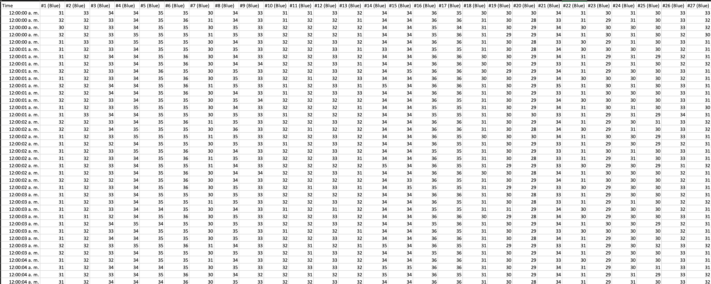
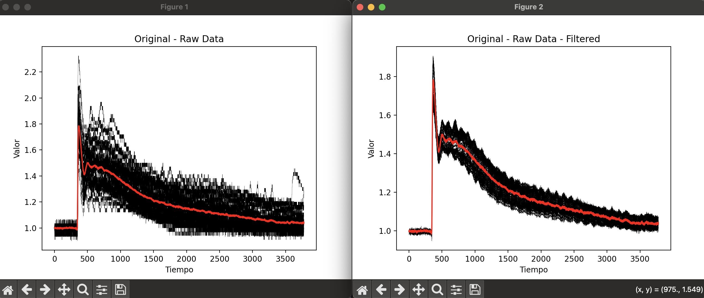
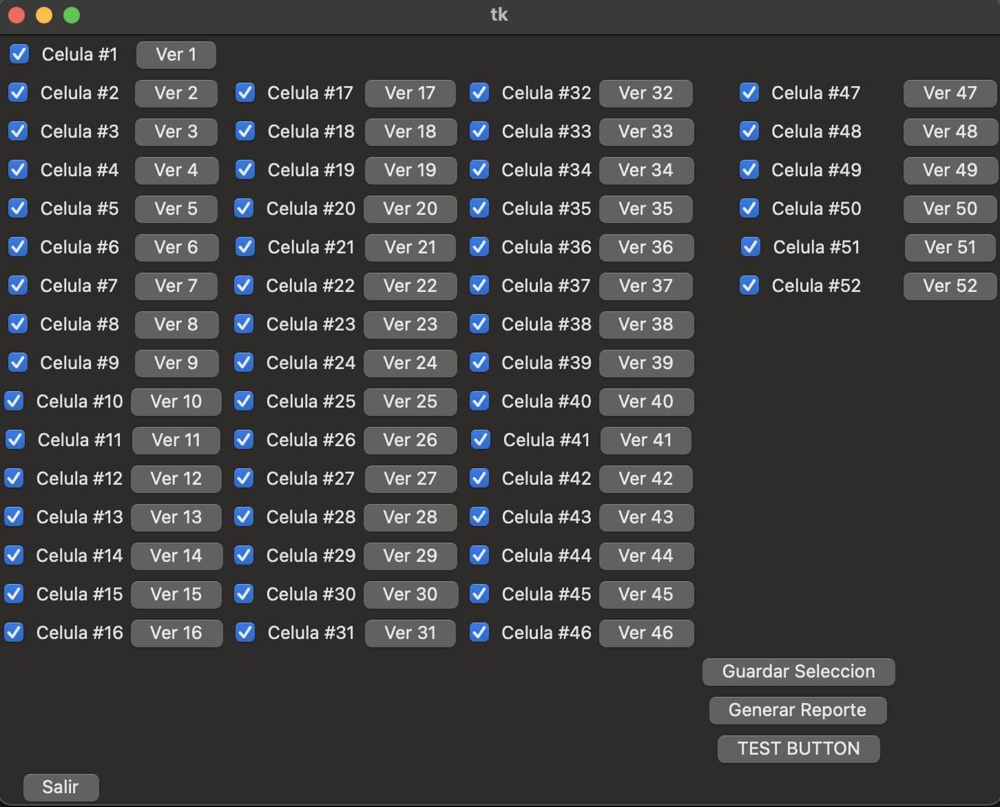
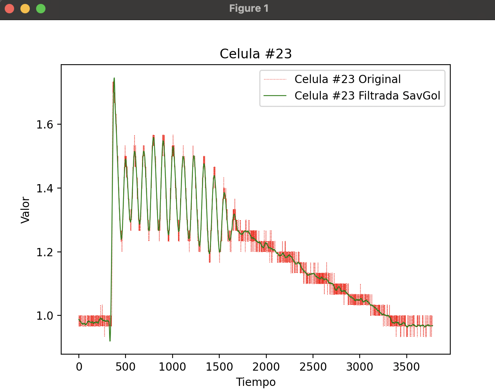
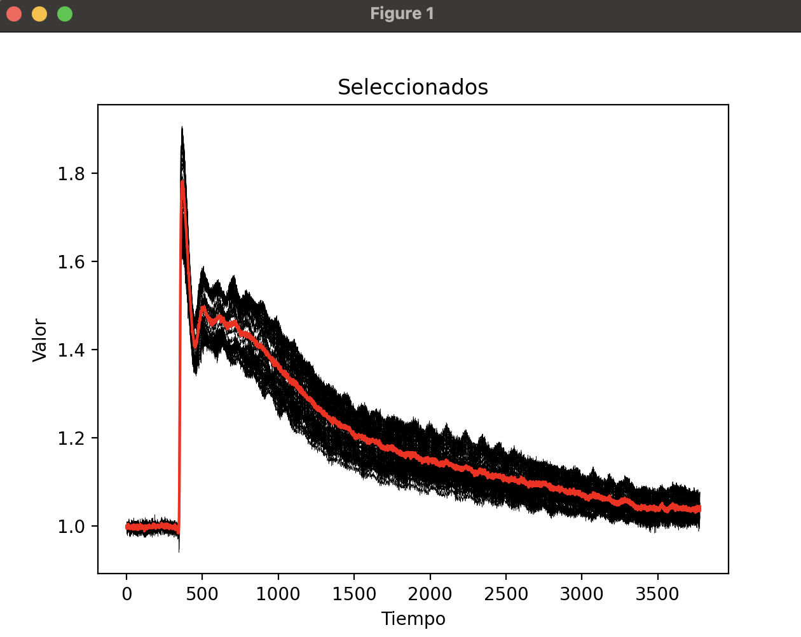

# CALCIUM DATA ANALYSIS SCRIPT
## Introduction
This script is designed to analyze a specific dataset. Such dataset is provided in an excel file from an experimental result of _______. An example of such data set is on ***Control_1408.xlsx*** file.

### Dataset sample:

## User guide
The first thing that is shown after selecting the dataset file is such dataset without filters and with them applied. Each of the black lines that are shown is every cell individually. The red line is the mean from all cells. The filter applied is the Savgol filter. [(Read more about it)](https://en.wikipedia.org/wiki/Savitzky%E2%80%93Golay_filter)

After closing both plots, an screen is shown where you can select if you want to preview a single cell plot or excluding it from the set.

If you preview a cell, you can see it with and without filters.

If you deselect a cell, you are presented with the selected cells plot preview.

Then you can select if you want to save the selected cells plot by clicking on "Guardar seleccion" button.
